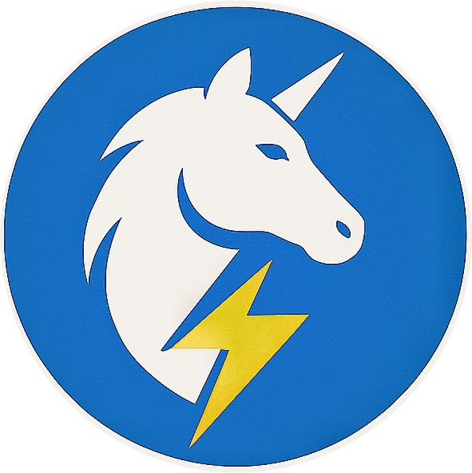

# 🚀 UniBolt — The Gamified Internship Ecosystem

<p align="center">
  
</p>

<p align="center">
  <b>Don't just watch tutorials. Solve daily tasks, climb the leaderboard, and unlock verified certificates + source code.</b>
</p>

<p align="center">
  <a href="https://unibolt.in">Live Site</a> •
  <a href="#features">Features</a> •
  <a href="#project-structure">Structure</a> •
  <a href="#setup">Setup</a> •
  <a href="#tech-stack">Tech Stack</a>
</p>

---

## 📖 What is UniBolt?

UniBolt is a **gamified virtual internship platform** built by a B.Tech student for students. Instead of just watching tutorials, learners:

1. **Enroll** in an internship track (Web Dev, AI/Data Science, App Dev)
2. **Complete daily practical tasks** — each day unlocks the next (like a game)
3. **Compete on a live leaderboard** — climb the ranks with speed and accuracy
4. **Earn a verified certificate** with a unique QR code upon completion
5. **Top performers unlock premium final-year project source code**

It is designed to bridge the gap between college education and real-world industry skills, making learning competitive, structured, and rewarding.

---

## ✨ Features

### 🎓 For Students
| Feature | Description |
|---|---|
| **Scholarship Exam Portal** | An AI-proctored, timed exam with face detection, tab-switch detection, and fullscreen enforcement. Students who score high unlock 100% fee scholarships. |
| **Student Dashboard** | Personalized dashboard showing progress, daily tasks, rank, streak, and certificates. |
| **Live Leaderboard** | Real-time ranking of all enrolled students by score and task completion. |
| **Certificate Verification** | Every certificate has a unique ID + QR code that can be verified at `unibolt.in/verify`. |
| **AI Mentor** | Built-in AI assistance to help students when they are stuck on tasks. |
| **Live Code Arena** | Browser-based coding environment — no software installation required. |
| **AI Notes & Roadmap** | AI-generated personalized notes and learning roadmaps for each track. |
| **Tickets & Support** | Students can raise support tickets directly from the platform. |
| **App Dev Practice Gym** | Interactive Flutter/Dart quiz challenges and bug hunt exercises with XP rewards. |

### 🛡️ For Admins
| Feature | Description |
|---|---|
| **Admin Dashboard** | Central command center with live stats — total students, pass rate, flagged users. |
| **Exam Manager** | Add, edit, and delete exam questions per course track. Settings for timer, pass marks, registration toggle, and maintenance mode. |
| **Student Monitor** | Live view of all students taking the scholarship exam, their scores, status, and violations. |
| **Notifications** | Send bulk or individual emails to students via Zoho Mail. |
| **Registrations Manager** | View and manage all enrolled students with payment status. |
| **Analytics** | Charts and graphs showing enrollment trends, performance stats, and activity. |
| **FAQ Manager** | Add and edit FAQ content shown on the landing page. |
| **Content Manager** | Manage all platform content and resource materials. |

---

## 🛤️ Internship Tracks

| Track | Duration | Status |
|---|---|---|
| **Full Stack Web Development** (React, Node.js, Firebase) | 30 Days | ✅ Available |
| **AI & Data Science** (Python, Pandas, ML) | 25 Days | ✅ Available |
| **App Development** (Flutter) | 30 Days | ✅ Available |

---

## 🗂️ Project Structure

```
UNIBOLT/
│
├── index.html              # Landing page (hero, tracks, leaderboard, FAQ)
├── signup.html             # Web Dev track registration
├── signup-ai.html          # AI track registration
├── login.html              # Student login
├── dashboard.html          # Student dashboard (tasks, progress, rank)
├── scholarship-exam.html   # AI-proctored scholarship exam portal
├── leaderboard.html        # Public leaderboard
├── verify-certificate.html # Certificate verification page
│
├── admin.html              # Admin main dashboard
├── admin-login.html        # Admin login
├── admin-exam.html         # Exam question manager + live student monitor
├── admin-registrations.html# Student registrations manager
├── admin-notifications.html# Email notification system
├── admin-analytics.html    # Analytics charts
├── admin-content.html      # Content management
├── admin-faq.html          # FAQ management
├── admin-settings.html     # Platform settings
├── admin-reports.html      # Reports
├── admin-submissions.html  # Task submissions
├── admin-tickets.html      # Support tickets
├── admin-team.html         # Team management
├── admin-activity.html     # Activity logs
│
├── AI.html                 # AI track dashboard
├── APP.html                # App Dev track dashboard
├── APP-studio.html         # Flutter code studio/IDE
├── APP-components.html     # Flutter component hub
├── APP-play.html           # App store / published apps
├── app-practice.html       # App Dev practice gym (Flutter quizzes & bug hunt)
├── signup-app.html         # App Development track registration
├── ai-notes.html           # AI-generated notes
├── ai-roadmap.html         # Personalized roadmap
├── AIarena.html / arena.html # Code arena
│
├── server.js               # Express backend (email API)
├── api/send-email.js       # Vercel serverless email handler
├── Backend/server.js       # Standalone backend server
├── firebase-config.js      # Firebase configuration
├── firebase.json           # Firebase hosting config
├── vercel.json             # Vercel deployment config
│
├── home.css / home.js      # Landing page styles & scripts
├── dashboard.css           # Dashboard styles
├── style.css               # Global styles
└── sw.js / sw-admin.js     # Service workers (PWA support)
```

---

## 📸 Pages & Screenshots

### 🏠 Landing Page — All Tracks Active
All three internship tracks now display with live **Enroll Now** buttons.


### 📱 App Development Registration (`signup-app.html`)
3-step registration form for the Flutter/App Dev track with UPI payment.


### 🏋️ App Dev Practice Gym (`app-practice.html`)
Interactive Flutter/Dart skill challenges with bug hunt and concept quizzes.


### 🛡️ Admin Login (`admin-login.html`)
Secure admin portal — now correctly redirects to `admin.html` after authentication.


### 📄 All Pages Built / Fixed

| Page | Description | Status |
|---|---|---|
| `index.html` | Landing page — App Dev track now active | ✅ Fixed |
| `signup-app.html` | App Development track registration | ✅ New |
| `app-practice.html` | Flutter practice gym (quiz + bug hunt) | ✅ New |
| `APP.html` | App Dev student dashboard | ✅ Fixed links |
| `APP-studio.html` | Flutter code studio | ✅ Fixed links |
| `APP-components.html` | Flutter component hub | ✅ Fixed links |
| `APP-play.html` | App store / published apps | ✅ Fixed links |
| `admin-login.html` | Admin login portal | ✅ Fixed redirect |
| `admin.html` + 10 sub-pages | Admin dashboard and tools | ✅ Fixed links |
| `AI.html` + 7 AI pages | AI track dashboard and tools | ✅ Fixed links |
| 30+ other pages | General navigation links | ✅ Fixed links |

---

## ⚙️ Setup & Local Development

### Prerequisites
- Node.js v18+
- A Firebase project (Firestore enabled)
- A Zoho Mail account (for email notifications)

### 1. Clone the Repository
```bash
git clone https://github.com/Harshitkashyap2027/UNIBOLT.git
cd UNIBOLT
```

### 2. Install Dependencies
```bash
npm install
```

### 3. Configure Environment Variables
```bash
cp .env.example .env
```

Edit `.env` and fill in your values:
```env
ZOHO_USER=admin@yourdomain.com
ZOHO_PASSWORD=your_zoho_app_password
PORT=5000
```

> ⚠️ **Never commit `.env` to version control.** It is already in `.gitignore`.

### 4. Firebase Setup
1. Create a project at [Firebase Console](https://console.firebase.google.com/)
2. Enable **Firestore Database**
3. Enable **Authentication** (Email/Password)
4. Copy your Firebase config into the pages that need it (or update `firebase-config.js`)
5. Create the following Firestore collections:
   - `users` — registered students
   - `students` — scholarship exam participants
   - `questions` — exam questions (managed via admin panel)
   - `settings` — exam configuration (`settings/config` document)

### 5. Run the Email Backend Server
```bash
npm start
# Server runs at http://localhost:5000
```

### 6. Deploy
- **Frontend**: Deploy to [Vercel](https://vercel.com) or Firebase Hosting
- **Backend API**: The `api/send-email.js` file is a Vercel serverless function (auto-deployed)
- Add `ZOHO_PASSWORD` as an environment variable in your Vercel project settings

---

## 🔥 Firestore Data Structure

### `settings/config` (Exam Configuration)
```json
{
  "maintenanceMode": false,
  "registrationOpen": true,
  "timer": 30,
  "passMarks": 45,
  "allowRetakes": false
}
```

### `questions/{docId}` (Exam Questions)
```json
{
  "course": "web",
  "q": "What does DOM stand for?",
  "opts": ["Document Object Model", "Data Object Mode", "Digital Ordinance Model", "Desktop Orientation Module"],
  "ans": 0,
  "timestamp": "2026-01-01T00:00:00Z"
}
```

### `students/{docId}` (Exam Participants)
```json
{
  "name": "Student Name",
  "email": "student@email.com",
  "phone": "9999999999",
  "city": "Delhi",
  "state": "Delhi",
  "course": "web",
  "ipAddress": "1.2.3.4",
  "startTime": "2026-01-01T10:00:00Z",
  "status": "Completed",
  "score": 47,
  "tabWarnings": 0,
  "faceWarnings": 0,
  "reward": "BOLT-ABC123"
}
```

---

## 🛡️ Scholarship Exam — How It Works

1. Student visits `scholarship-exam.html`
2. System checks Firestore `settings/config` for maintenance mode / registration status
3. Student agrees to terms and fills registration form
4. IP address and email uniqueness are verified against Firestore
5. Questions are loaded from the Firestore `questions` collection (falls back to local bank if empty)
6. **AI Proctoring activates**: webcam face detection, tab-switch detection, fullscreen enforcement
7. Student answers 50 questions within the timer
8. Score is saved to Firestore and a reward is granted based on score:
   - **50/50** → 100% Scholarship + Dashboard access
   - **45-49** → Platinum Coupon (80% off)
   - **30-44** → Referral Code
9. Result card can be downloaded as an image with QR code

---

## 🔐 Security Notes

- Admin pages are protected by Firebase Authentication
- The scholarship exam enforces single-attempt via IP + email check
- Proctoring via face detection (webcam), tab-switch events, fullscreen exit, right-click, keyboard shortcuts
- Email credentials are stored as environment variables (never hardcoded)
- All Firebase API keys are client-side (expected for Firebase web apps); secure your Firestore with proper Security Rules

---

## 🧰 Tech Stack

| Layer | Technology |
|---|---|
| **Frontend** | HTML5, CSS3, Vanilla JavaScript |
| **UI/Animation** | Font Awesome, AOS (Animate on Scroll), Google Fonts |
| **Database** | Firebase Firestore |
| **Authentication** | Firebase Authentication |
| **Email** | Zoho Mail via Nodemailer (SMTP) |
| **AI Proctoring** | `@vladmandic/face-api` (TinyFaceDetector model) |
| **Backend** | Node.js + Express.js |
| **Serverless API** | Vercel Functions (`api/send-email.js`) |
| **Hosting** | Vercel / Firebase Hosting |
| **PWA** | Service Workers + Web App Manifests |
| **QR Codes** | qrcodejs |
| **Canvas Export** | html2canvas |

---

## 👨‍💻 About the Creator

UniBolt was built by **Harshit Kashyap**, a 3rd-year B.Tech student at COER University. The platform is a solo project designed to help students like himself gain real-world experience through a structured, gamified internship ecosystem.

---

## 📬 Contact

- **WhatsApp**: [+91 92588 37596](https://wa.me/919258837596)
- **Website**: [unibolt.in](https://unibolt.in)
- **Email**: admin@unibolt.in

---

## 📄 License

© 2026 UniBolt Inc. Made with ❤️ in India.
